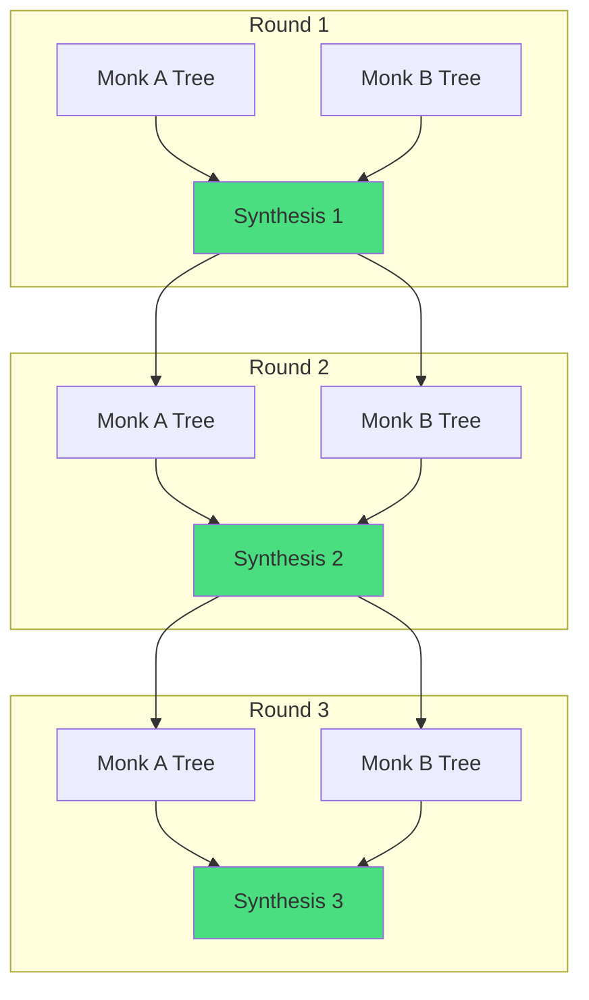

# Alexander: A City is Not a Tree

Christopher Alexander's 1965 essay "A City is Not a Tree" reveals why the dialectic's output is structurally richer than any single linear argument.

## Semi-Lattice vs Tree Structure

Alexander showed that natural cities have **semi-lattice structure** — overlapping, cross-connected sets — while designed cities impose **tree structure** where every element belongs to exactly one branch.

<CardGroup cols={2}>
  <Card title="Tree Structure" icon="diagram-project">
    **Designed cities, org charts, hierarchies**
    
    - Every element belongs to exactly one branch
    - No overlapping sets
    - Easier to think about
    - Easier to design
    - **Destroys the cross-connections that make systems alive**
  </Card>
  <Card title="Semi-Lattice Structure" icon="network-wired">
    **Natural cities, living systems**
    
    - Overlapping, cross-connected sets
    - Multiple simultaneous memberships
    - Harder to think about
    - Harder to design
    - **Preserves the cross-connections that create vitality**
  </Card>
</CardGroup>

## The Design Problem

Every attempt to design semi-lattices directly has failed:

- Alexander's own HIDECS system
- Holacracy
- Spotify's squad model
- Graph partitioning algorithms

They all collapse back to trees.

<Warning>
**Why?** The design substrate — whether graph partitioning algorithms, org charts, or natural language — is **tree-biased.**

Language is tree-structured (Chomsky's generative grammar, dependency parsing, sequential token generation).
</Warning>

## The Skill as Semi-Lattice Compiler

**This skill is a semi-lattice compiler.** It doesn't try to generate semi-lattices directly. Instead:

<Steps>
  <Step title="Produce multiple committed trees">
    Each Electric Monk produces a tree — a coherent linear argument from committed premises to conclusions.
    
    Language forces this structure. Every argument must be sequential, hierarchical, tree-shaped.
  </Step>
  <Step title="Extract the atomic parts">
    The Boydian decomposition (Phase 4.5) strips both arguments of their tree structure.
    
    Claims, mechanisms, evidence, assumptions — separated from their source positions.
  </Step>
  <Step title="Find cross-connections">
    Look for surprising connections between elements that came from different trees.
    
    These cross-domain connections ARE the semi-lattice edges.
  </Step>
  <Step title="Construct the semi-lattice">
    The synthesis is the semi-lattice that emerges from the overlap of multiple trees.
    
    **It is constructed, not generated.**
  </Step>
</Steps>

<Info>
The answer to "language can't represent semi-lattices" is not "make the LLM output a semi-lattice directly." 

It's: **produce multiple trees from different committed positions, then extract the cross-connections.**
</Info>

## Examples from Successful Systems

Every successful semi-lattice system works this way:

<AccordionGroup>
  <Accordion title="Gene Ontology" icon="dna">
    **How it works:**
    - Multiple independent studies (trees)
    - Each produces its own hierarchical classification
    - Cross-referenced into a DAG (directed acyclic graph)
    
    **The semi-lattice edges:** Cross-references between studies that reveal the same gene/protein playing different roles in different biological pathways.
  </Accordion>
  
  <Accordion title="McChrystal's Team of Teams" icon="users">
    **How it works:**
    - Tree-structured teams (traditional hierarchy)
    - Liaison officers create cross-connections
    - "Eyes-on, hands-off" coordination
    
    **The semi-lattice edges:** Liaison relationships that allow knowledge to flow across organizational boundaries without destroying the tree structure of each team.
  </Accordion>
  
  <Accordion title="Ostrom's Polycentric Governance" icon="landmark">
    **How it works:**
    - Multiple overlapping jurisdictions (not one hierarchy)
    - Each jurisdiction operates independently
    - Cross-coordination on shared resources
    
    **The semi-lattice edges:** Overlapping authority boundaries where multiple jurisdictions must coordinate — water rights, air quality, regional transit.
  </Accordion>
</AccordionGroup>

## Why Monk B is Always Right

In any dialectic about the skill itself, **Monk B is always right that its output is a tree.**

Each monk's essay IS tree-structured. Language forces this.

**But Monk B is wrong that the *process* produces a tree.** The process produces a semi-lattice by:

1. Generating multiple committed trees (the monks)
2. Shattering them (Boydian decomposition)
3. Finding cross-connections (Phase 4.5)
4. Synthesizing the overlapping structure (Phase 5)

## The Recursion Advantage

Each recursive round adds another tree to the compilation:

By Round 3, the semi-lattice has been compiled from **six committed trees** plus all the cross-connections discovered during three rounds of Boydian decomposition.

<Info>
**This is why recursive rounds produce structurally richer output than Round 1.** Each round adds more trees to the compilation, creating more opportunities for cross-connections.
</Info>

## Natural Language as Compilation Target

The final synthesis is still written in natural language — which is tree-structured. But it's a *description* of a semi-lattice, not a tree.

Just as:
- A Go program (tree-structured syntax) can describe a graph data structure
- An org chart (tree) can document liaison relationships (semi-lattice)
- English prose (sequential) can explain Gene Ontology (DAG)

**The dialectical trace** — the full set of monk essays, structural analysis, and synthesis — is the semi-lattice. The synthesis document is its textual representation.

## Implications for the User

When you read the synthesis, you're not reading a linear argument. You're reading a **map of cross-connected insights** that couldn't exist in either monk's tree alone.

<Card title="What This Feels Like" icon="lightbulb">
As you read through the Monks' committed arguments, connections come to mind — things neither side considered, corrections to their framing, ideas you hadn't articulated yet.

You feed these back in. The skill tunes to your thinking with each round, but also rigorously exposes contradictions — so you get an increasingly full and precise map of your own ideas.

Then the skill breaks it apart and reforms it as **something richer and more interesting than what you started with.**
</Card>

---

<CardGroup cols={2}>
  <Card title="Previous: Boyd's Destruction" icon="arrow-left" href="/theory/boyd-destruction-creation">
    Shattering concepts and finding cross-domain connections
  </Card>
  <Card title="Next: Additional Frameworks" icon="arrow-right" href="/theory/additional-frameworks">
    Socrates, Peirce, Galinsky, and more
  </Card>
</CardGroup>