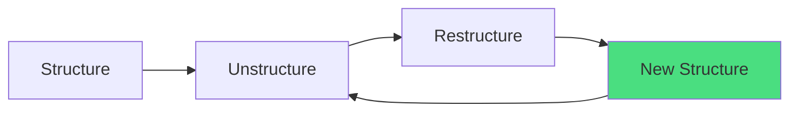

# Boyd: Destruction and Creation

John Boyd's "Destruction and Creation" (1976) provides the engine for *what to do with the wreckage* after determinate negation reveals how each position fails.

## Boyd's Critical Insight

<Warning>
**You cannot synthesize something genuinely new by recombining within the same domain.**
</Warning>

If Monk A and Monk B are both arguing about web frameworks, a synthesis that only recombines claims from their two essays will produce **rearrangement, not creation.**

Genuine novelty requires material from *outside* the original conceptual domains.

## The Dialectic Engine

Boyd's process has two phases:

### 1. Destructive Deduction

**Shatter existing conceptual domains and scatter parts into a "sea of anarchy."**

Strip concepts from their original wholes. Break arguments into atomic components. Remove the source labels.

The destructive step creates *space* for outside material to enter and form new connections.

### 2. Creative Induction

**Find cross-domain connections to synthesize something new.**

With atomic parts liberated from their original positions, you can now find connections that were invisible when the parts were trapped inside their source arguments.

<Info>
**The synthesis must have organizational properties that exist in *neither* input** — properties that can't be traced back to either monk's position. 

Genuine sublation produces **emergent structure.**
</Info>

## The Boydian Decomposition (Phase 4.5)

This is where Boyd enters the dialectical process operationally:

<Steps>
  <Step title="Identify the generic space">
    The abstract relational structure both positions share. What unit of analysis do both assume? What causal model? What temporal frame?
    
    This shared structure is often the thing the synthesis needs to transcend.
  </Step>
  <Step title="List atomic components">
    Individual claims, mechanisms, evidence, assumptions, metaphors, principles — stripped of which agent said them.
    
    Don't organize by position. Create an unstructured collection.
  </Step>
  <Step title="Look for surprising connections">
    What mechanisms from A illuminate evidence from B? What assumptions from B reframe principles from A?
    
    These connections were invisible when the parts were locked inside their original arguments.
  </Step>
  <Step title="Ask: what adjacent-domain material connects?">
    What analogies, frameworks, or mechanisms from *outside* the original debate space could bind these parts into something neither agent could have conceived?
    
    **This is where genuinely new concepts come from.**
  </Step>
</Steps>

### Emergent Structure Test

<Card title="Quality Check" icon="magnifying-glass">
The synthesis must have organizational properties that exist in *neither* input.

If every element of your synthesis is attributable to one monk or the other, you've **recombined, not created.**
</Card>

## Example: React/Vue Dialectic

From a test run showing Boydian decomposition in action:

<Accordion title="How shattering revealed a new concept">
**Original positions:**
- Monk A (React): Corporate lab model enables sustained innovation
- Monk B (Vue): Independent auteur model enables creative freedom

**Shattering both positions revealed:**
- "Legacy burden" (from the corporate lab essay)
- "Self-referential complexity" (from the auteur essay)

Were describing **the same phenomenon from different angles.**

**Liberated from their positions, they connected to form a new concept:**

"Innovation character is predicted by **legacy burden**, not funding source."

**This wasn't available from within either position.** It emerged from the cross-domain connection between two concepts that were trapped in different arguments.
</Accordion>

## Structure → Unstructure → Restructure

Boyd's full cycle:

Each synthesis becomes the next round's structure to be unstructured and restructured at a higher level of elaboration.

**This is why recursion works** — and why recursive rounds often need new research from *outside* the original domains.

## Cross-Domain Material in Recursion

Each synthesis opens a new conceptual space that the original research didn't cover.

<Accordion title="Example: 7-Cycle Agent Identity Dialectic">
Successive rounds pulled in:

1. Stream theory (not in original research)
2. Naming/identity theory (not in original research)
3. Cognitive science (not in original research)
4. **Gödel's incompleteness theorem** (not in original research)
5. **Coasean transaction cost theory** (not in original research)
6. **Jurisprudential concepts** (not in original research)
7. **Constitutional design patterns** (not in original research)

None of these were in the Round 1 research. The synthesis *created the space* for this new material to enter.

**This is exactly Boyd's prediction:** The destructive step liberates parts that can now connect with material from outside the original domains.
</Accordion>

## Relationship to Hegel

Boyd and Hegel are complementary:

<CardGroup cols={2}>
  <Card title="Hegel Provides" icon="compass">
    - The engine for analyzing *how* positions fail (determinate negation)
    - The concept of what good synthesis looks like (Aufhebung)
    - The method for finding complementary blind spots
  </Card>
  <Card title="Boyd Provides" icon="hammer">
    - The engine for *what to do with the wreckage*
    - The method for shattering and scattering atomic parts
    - The requirement for cross-domain connections
    - The prediction that recursion needs new material
  </Card>
</CardGroup>

Hegel drives the contradiction analysis. Boyd drives the creative reconstruction.

## Operational Presence

Boyd appears in three phases of the skill:

1. **Phase 4.5** — Boydian Decomposition (the destructive step)
2. **Phase 5** — Sublation requiring cross-domain connection (the creative step)
3. **Phase 7** — Recursion (Structure → Unstructure → Restructure repeated at higher levels)

<Info>
**Why the orchestrator's Phase 1 research breadth matters:**

The wider your research covered adjacent domains, the more cross-domain connections become visible during the Boydian decomposition.

You can only find connections to material you know exists.
</Info>

---

<CardGroup cols={2}>
  <Card title="Previous: Hegel's Dialectics" icon="arrow-left" href="/theory/hegel-dialectics">
    Determinate negation and Aufhebung
  </Card>
  <Card title="Next: Alexander's Semi-Lattice" icon="arrow-right" href="/theory/alexander-semi-lattice">
    Why the output is structurally richer than any linear argument
  </Card>
</CardGroup>